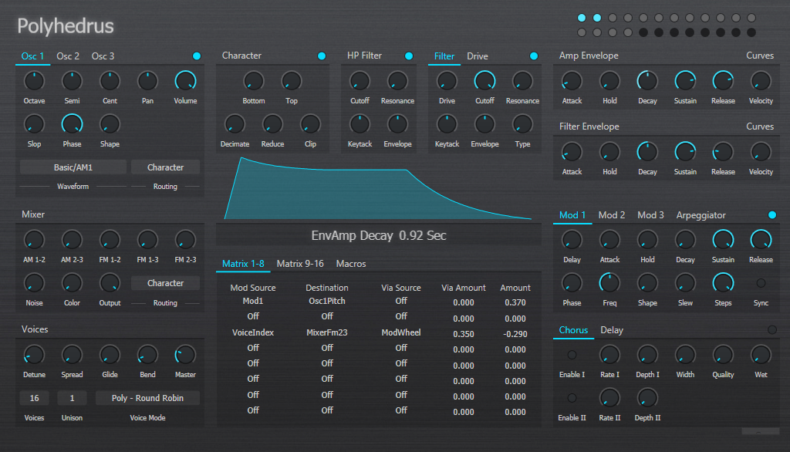

# Polyhedrus - Digital Synthesizer

Polyhedrus is a wavetable synthesizer, currently in the early stages of development.

## Technical Specifications

* Cross-platform synthesis engine written in C++.
* Hard real-time audio synthesis algorithms.
* Portable code, uses Boost Libraries (v 1.59) and C++ 11.
* User Interface and audio engine communicate via Open Sound Control messages via UDP (using Boost.Asio in the sound engine).
* User interface implemented as a separate process.
	* Currently using C# WPF.
	* cross-platform replacement written in Javascript/React.js/Electron is under development.

## Features

* Bandlimited Wavetable Oscillators.
* Multimode filter with several unique filter designs. Current model includes:
	* 4-pole Ladder filder with Zero-delay Feedback.
	* 4-Poly cascaded ladder filter.
	* Dual SVF Filter.
* Individual Voice architecture.
* 16 slot Modulation matrix.
* Visual Feedback for waveforms and envelopes.

 

